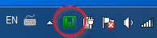
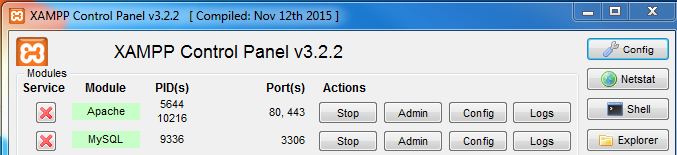
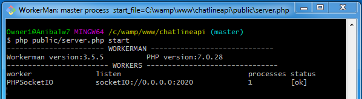

## ChatLine Aplicación

La aplicación consta de 3 componentes para el correcto funcionamiento.

1. Aplicacion front-end (**Angular**)
2. Aplicacion Servicio API REST (**PHP SlimFramework**)
3. Aplicacion Servicio Socket (**PHP**)

### 1. Instalar herramientas de desarrollo

Instalar todas las aplicaciones en el siguiente ordén

Programas de ejecución:

* [Nodejs v8.1](https://nodejs.org/es/) (entorno de ejecucion para javascript)
* [Yarn](https://yarnpkg.com/en/) (instalador de dependencias nodejs)
* [Composer](https://getcomposer.org/) (instalador de dependencias php)
* [Git](https://git-scm.com/) (sistema de control de versiones)

Programas servidores:

* [Wampserver v3.0.6](http://www.wampserver.com/) (servidor web)
* [XAMMPP v7.0.29](https://www.apachefriends.org) (servidor web)

Programas editores:

* [Sublime text v3](https://www.sublimetext.com/) (editor de texto)
* [Visual Studio Code](https://code.visualstudio.com/) (editor de texto)

Despues de instalar los **programas de ejecucion**, y **programas editores** instalar por ultimo los **programas servidores** (pero no iniciar o arrancar el programa eso lo veremos en el siguiente paso)

### 2. Instalar y configurar servidores

#### 2.1 Configurar GITHUB

Necesitamos configurar github creando una conección por el protocolo SSH
debes seguir los [siguientes pasos](https://help.github.com/articles/connecting-to-github-with-ssh/)

#### 2.2 Configurar Wampserver como servidor (Aplicacion Servicio API REST)

Iniciar wampserver: 
	
	Inicio > Wampserver

;

**1**  
Detener la base de datos MYSQL: 
	
	Icono Wampserver > MySQL > Service administration wampmysqld > stop service

Ahora solo queda cambiar el puerto web por defecto de 80 a 8080. Debemos editar el archivo php.ini

	Wampserver > PHP > php.ini

Modificar como se muestra:

	#Listen 12.34.56.78:80
	Listen 0.0.0.0:8080
	Listen [::0]:8080

**2**  
Configuración opcional: configurar los los accesos directos de wampserver aplicacion que siguen con el puerto por defecto al puerto 8080.
Buscar en el archivo el texto: ;WAMPMENULEFTSTART y agregar el puero 8080 

	http://localhost/		=> http://localhost:8080/

**3**  
Descargar el proyecto [CHATLINEAPI](https://github.com/enlacee/chatlineapi) en `c:/wamp/www`
clonar el repositorio. (eliminar todos los archivos que existan en esta carpeta antes de clonar)

``` bash
	git clone git@github.com:enlacee/chatlineapi.git
	git clone https://github.com/enlacee/chatlineapi.git
```

despues de descargar el proyecto debemos de configurar el virtualhost para indicarle la nueva ruta del servidor que sera: `c:/wamp/www/chatlineapi/public`

**4**  
Configurar el virtualhost por defecto que se encuentra en:

	Wampserver > Apache > htttpd-vhosts.conf

dejarlo de esta manera:
la variable `Require all granted` es necesario para que otras Computadoras de la red tengan acceso a este servidor.

	<VirtualHost *:8080>
	  ServerName localhost
	  ServerAlias localhost
	  DocumentRoot "${INSTALL_DIR}/www/chatlineapi/public"
	  <Directory "${INSTALL_DIR}/www/chatlineapi/public">
	    Options +Indexes +Includes +FollowSymLinks +MultiViews
	    AllowOverride All
	    Require all granted
	  </Directory>
	</VirtualHost>

**5**  
Configurar en PHP el limite del tamaño del archivo, como limite seran 8M.

	Wampserver > PHP > Php Settings > upload_max_filesize = 8MB

**6**  
Configurar Apache

Agregar o modificar el archivo `c:/wamp/www/chatlineapi/public/.htaccess`

* Permitir el acceso con CORS
* Sobreescribir las URLS

``` 
	<IfModule mod_rewrite.c>
	  Header add Access-Control-Allow-Origin "*"
	  Header add Access-Control-Allow-Methods: "GET, POST, PUT, DELETE, PATCH, OPTIONS"
	  Header add Access-Control-Allow-Headers: "Content-Type"
	  
	  RewriteEngine On
	  RewriteCond %{REQUEST_URI}::$1 ^(/.+)/(.*)::\2$
	  RewriteRule ^(.*) - [E=BASE:%1]
	  
	  # If the above doesn't work you might need to set the `RewriteBase` directive manually, it should be the
	  # absolute physical path to the directory that contains this htaccess file.
	  # RewriteBase /

	  RewriteCond %{REQUEST_FILENAME} !-f
	  RewriteRule ^ index.php [QSA,L]
	</IfModule>
```

Luego de esto necesitarmos activar el modulo `Headers` de apache sino dara error al reiniciar el servidor

	Wampserver > Apache > Apache modules > headers_module

**7**  
Cambiar el usuario y la clave para acceder a la base de datos
que se encuentra en la dirección `c:/xampp/htdocs/src/settings.php`
cambiar a los valores según la configuracion interna o agregar la configuración por defecto **root**

		'database' => [
			'host' => 'localhost',
			'user' => 'root',
			'pass' => '',
			'dbname' => 'chatline',
		],

Reiniciar los servicios wampserver

	Wampserver > Restart all services

**8**  
Generar los datos base y de prueba
Acceder por el navegador web a la URL:

	localhost:8080/v1/faker-data

#### 2.3 Configurar XAMPP como servidor web(Aplicacion front-end)

Iniciar XAMPP

	Inicio > XAMPP control panel

Iniciar los modulos de Apache y MYSQL

;

**1**  
Descargar el proyecto [CHATLINE](https://github.com/enlacee/chatline) en `c:/xampp/htdocs`
Clonar el repositorio. (eliminar todos los archivos que existan en esta carpeta antes de clonar)

``` bash
	git clone git@github.com:enlacee/chatline.git
	git clone https://github.com/enlacee/chatline.git
```

**2**  
Iniciar proyecto situarse dentro del proyecto

	cd chatline

**3**  
Instalar las dependencias con `npm` o `yarn`

	yarn install
	npm install

Este proceso demora unos minutos dejar instalando.

**4**  
Ver el numero de tu IPv4 Address ir a: `Inicio > CMD`

	ipconfig

Si es necesario cambiar el numero de IP en el archivo `src/app/variable-global.service.ts`  
de `192.168.1.40` a `abc.xyz.a.bb`

	public apiURLBase:string = 'http://192.168.1.40:8080';
	public apiURL:string = 'http://192.168.1.40:8080/v1';
	public apiURLsocket: string = 'http://192.168.1.40:2020';

**apiURLBase**: La url base del API REST
**apiURL**: La url del API REST version 1
**apiURLsocket**: La url del socket que utilizamos para emitir los mensajes de los usuarios

**5**  
GENERAR EL LOS ARCHIVOS PARA PRODUCCION

	ng build --prod --base-href ./

Los archivos web se generan en el directorio `dist`  
Cortar todos los archivos y pegarlos dentro de `C:\xampp\htdocs`

**6**  
Debemos configurar el servidor apache con las siguientes instrucciones del archivo `.htaccess`

	RewriteEngine on
	RewriteCond %{REQUEST_FILENAME} -s [OR]
	RewriteCond %{REQUEST_FILENAME} -l [OR]
	RewriteCond %{REQUEST_FILENAME} -d
	RewriteRule ^.*$ - [NC,L]
	 
	RewriteRule ^(.*) /index.html [NC,L] 

#### 2.3 Iniciar el socket

	cd C:\wamp\www\chatlineapi
	php public/server.php start

;


### 2. Acceder a la aplicación

Acesso para los usuarios del chat:

	localhost

Acceso para el administrador del chat:
	
	localhost/admin

Para acceder a la aplicacion de cualquier equipo que perteneca a la red 